<h1 id="trabajos-solidworks">Dibujos de Práctica en SolidWorks (Ismael Guerrero)</h1>

    Esta sección documenta una serie de 40 ejercicios de modelado paramétrico. A continuación, se presenta un *único visor de PDF* que contiene todos los planos técnicos y vistas 3D de los dibujos. Debajo del visor, encontrará los enlaces individuales para descargar el archivo de diseño nativo (<strong>.SLDPRT</strong>) de cada pieza.

---

##  Visor Global de 40 Planos

<iframe 
    src="https://drive.google.com/file/d/10QIqpOe2T-fnyyB329lgMe0H_2QZO3ud/preview" 
    style="width:100%; height:600px; border: 1px solid #ccc;" 
    frameborder="0" 
    allowfullscreen>
</iframe>

---

## Descarga de Archivos CAD por Pieza

<h2 id="dibujo-1">Dibujo 1 Ismael Guerrero</h2>

Descarga del archivo de la pieza CAD nativa.

    <a href="../recursos/archivos/EJERCICIO1JIGR.SLDPRT" target="_blank">[Descargar (SLDPRT)]</a>

    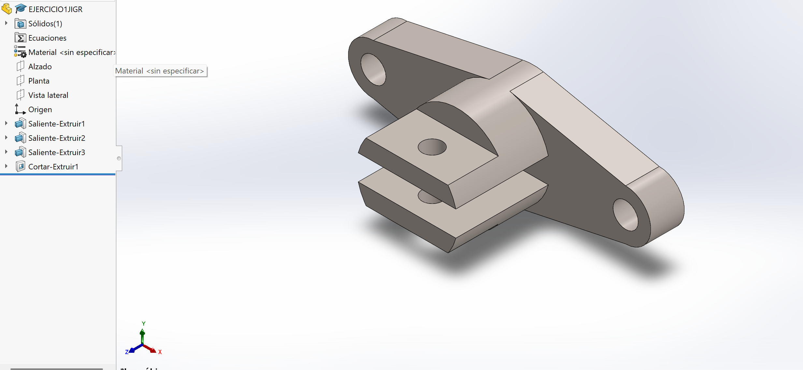

---

<h2 id="dibujo-2">Dibujo 2 Ismael Guerrero</h2>

Descarga del archivo de la pieza CAD nativa.

    <a href="../recursos/archivos/EJERCICIO2JIGR.SLDPRT" target="_blank">[Descargar (SLDPRT)]</a>

    

---

<h2 id="dibujo-3">Dibujo 3 Ismael Guerrero</h2>

Descarga del archivo de la pieza CAD nativa.

    <a href="../recursos/archivos/EJERCICIO3JIGR.SLDPRT" target="_blank">[Descargar (SLDPRT)]</a>

    

---

<h2 id="dibujo-4">Dibujo 4 Ismael Guerrero</h2>

Descarga del archivo de la pieza CAD nativa.

    <a href="../recursos/archivos/EJERCICIO4JIGR.SLDPRT" target="_blank">[Descargar (SLDPRT)]</a>

    

---

<h2 id="dibujo-5">Dibujo 5 Ismael Guerrero</h2>

Descarga del archivo de la pieza CAD nativa.

    <a href="../recursos/archivos/EJERCICIO5JIGR.SLDPRT" target="_blank">[Descargar (SLDPRT)]</a>

    

---

<h2 id="dibujo-6">Dibujo 6 Ismael Guerrero</h2>

Descarga del archivo de la pieza CAD nativa.

    <a href="../recursos/archivos/EJERCICIO6JIGR.SLDPRT" target="_blank">[Descargar (SLDPRT)]</a>

    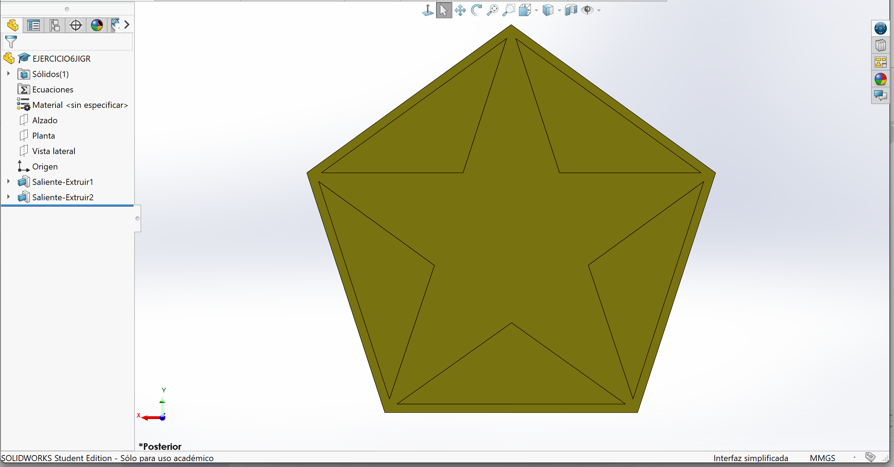

---

<h2 id="dibujo-7">Dibujo 7 Ismael Guerrero</h2>

Descarga del archivo de la pieza CAD nativa.

    <a href="../recursos/archivos/EJERCICIO7JIGR.SLDPRT" target="_blank">[Descargar (SLDPRT)]</a>

    

---

<h2 id="dibujo-8">Dibujo 8 Ismael Guerrero</h2>

Descarga del archivo de la pieza CAD nativa.

    <a href="../recursos/archivos/EJERCICIO8JIGR.SLDPRT" target="_blank">[Descargar (SLDPRT)]</a>

    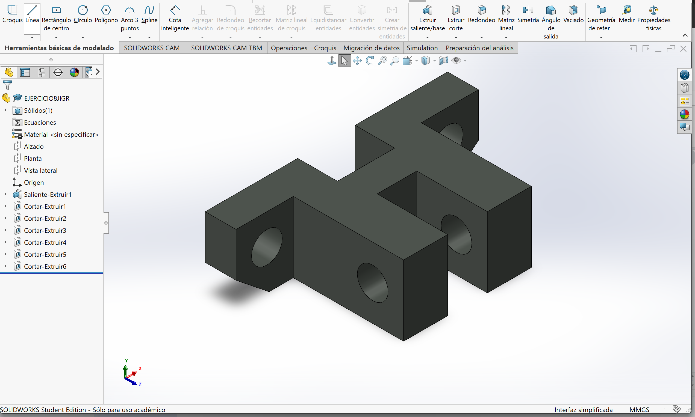

---

<h2 id="dibujo-9">Dibujo 9 Ismael Guerrero</h2>

Descarga del archivo de la pieza CAD nativa.

    <a href="../recursos/archivos/EJERCICIO9JIGR.SLDPRT" target="_blank">[Descargar (SLDPRT)]</a>

    

---

<h2 id="dibujo-10">Dibujo 10 Ismael Guerrero</h2>

Descarga del archivo de la pieza CAD nativa.

    <a href="../recursos/archivos/EJERCICIO10JIGR.SLDPRT" target="_blank">[Descargar (SLDPRT)]</a>

    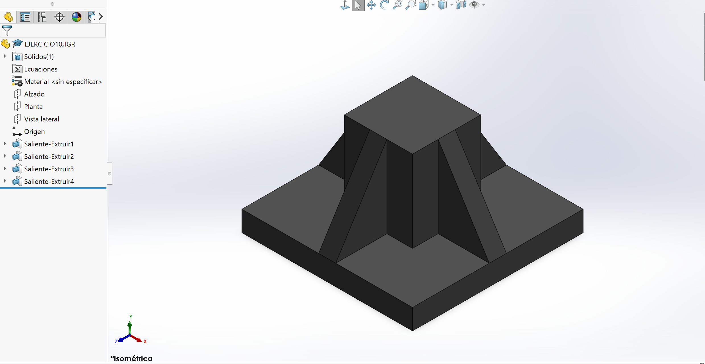

---

<h2 id="dibujo-11">Dibujo 11 Ismael Guerrero</h2>

Descarga del archivo de la pieza CAD nativa.

    <a href="../recursos/archivos/EJERCICIO11JIGR.SLDPRT" target="_blank">[Descargar (SLDPRT)]</a>

    

---

<h2 id="dibujo-12">Dibujo 12 Ismael Guerrero</h2>

Descarga del archivo de la pieza CAD nativa.

    <a href="../recursos/archivos/EJERCICIO12JIGR.SLDPRT" target="_blank">[Descargar (SLDPRT)]</a>

    

---

<h2 id="dibujo-13">Dibujo 13 Ismael Guerrero</h2>

Descarga del archivo de la pieza CAD nativa.

    <a href="../recursos/archivos/EJERCICIO13JIGR.SLDPRT" target="_blank">[Descargar (SLDPRT)]</a>

    

---

<h2 id="dibujo-14">Dibujo 14 Ismael Guerrero</h2>

Descarga del archivo de la pieza CAD nativa.

    <a href="../recursos/archivos/EJERCICIO14JIGR.SLDPRT" target="_blank">[Descargar (SLDPRT)]</a>

    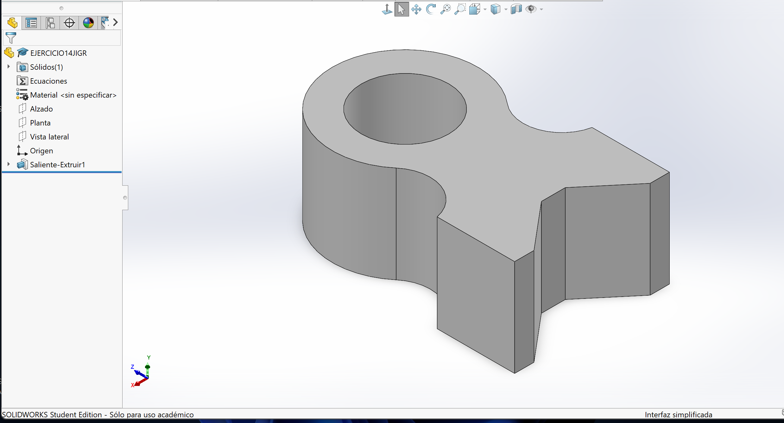

---

<h2 id="dibujo-15">Dibujo 15 Ismael Guerrero</h2>

Descarga del archivo de la pieza CAD nativa.

    <a href="../recursos/archivos/EJERCICIO15JIGR.SLDPRT" target="_blank">[Descargar (SLDPRT)]</a>

    

---

<h2 id="dibujo-16">Dibujo 16 Ismael Guerrero</h2>

Descarga del archivo de la pieza CAD nativa.

    <a href="../recursos/archivos/EJERCICIO16JIGR.SLDPRT" target="_blank">[Descargar (SLDPRT)]</a>

    

---

<h2 id="dibujo-17">Dibujo 17 Ismael Guerrero</h2>

Descarga del archivo de la pieza CAD nativa.

    <a href="../recursos/archivos/EJERCICIO17JIGR.SLDPRT" target="_blank">[Descargar (SLDPRT)]</a>

    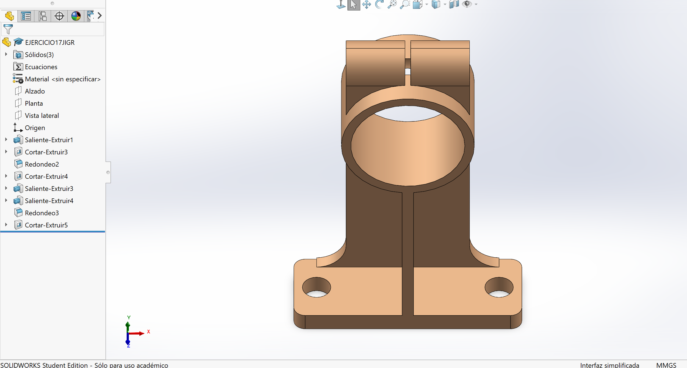

---

<h2 id="dibujo-18">Dibujo 18 Ismael Guerrero</h2>

Descarga del archivo de la pieza CAD nativa.

    <a href="../recursos/archivos/EJERCICIO18JIGR.SLDPRT" target="_blank">[Descargar (SLDPRT)]</a>

    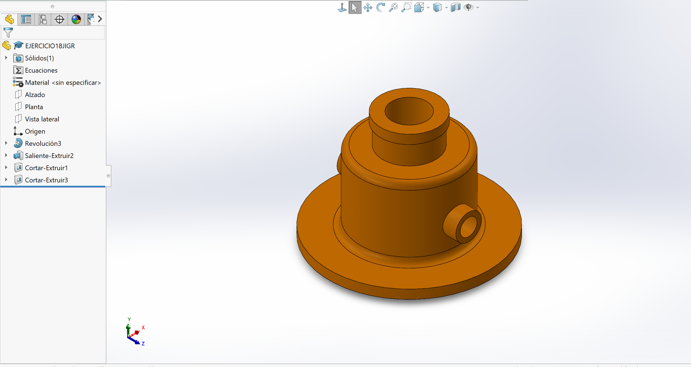

---

<h2 id="dibujo-19">Dibujo 19 Ismael Guerrero</h2>

Descarga del archivo de la pieza CAD nativa.

    <a href="../recursos/archivos/EJERCICIO19JIGR.SLDPRT" target="_blank">[Descargar (SLDPRT)]</a>

    

---

<h2 id="dibujo-20">Dibujo 20 Ismael Guerrero</h2>

Descarga del archivo de la pieza CAD nativa.

    <a href="../recursos/archivos/EJERCICIO20JIGR.SLDPRT" target="_blank">[Descargar (SLDPRT)]</a>

    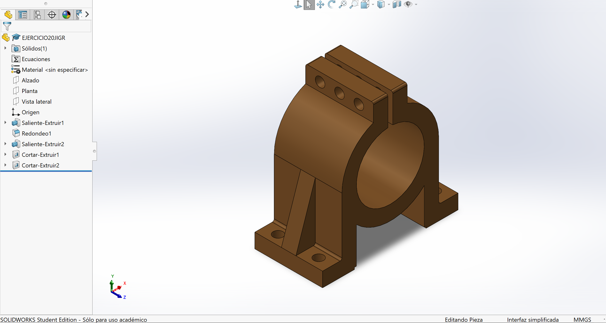

---
<h2 id="dibujo-22">Dibujo 22 Ismael Guerrero</h2>

Descarga del archivo de la pieza CAD nativa.

    <a href="../recursos/archivos/EJERCICIO22JIGR.SLDPRT" target="_blank">[Descargar (SLDPRT)]</a>

    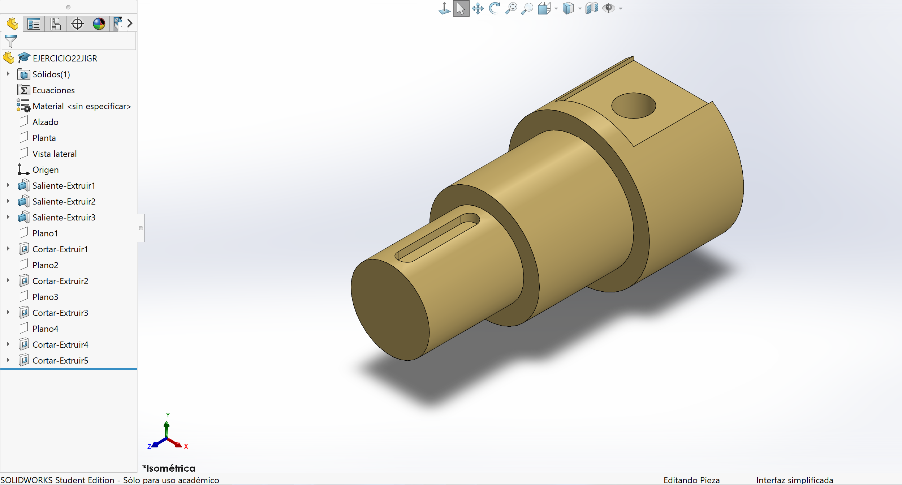

---

<h2 id="dibujo-23">Dibujo 23 Ismael Guerrero</h2>

Descarga del archivo de la pieza CAD nativa.

    <a href="../recursos/archivos/EJERCICIO23JIGR.SLDPRT" target="_blank">[Descargar (SLDPRT)]</a>

    

---

<h2 id="dibujo-24">Dibujo 24 Ismael Guerrero</h2>

Descarga del archivo de la pieza CAD nativa.

    <a href="../recursos/archivos/EJERCICIO24JIGR.SLDPRT" target="_blank">[Descargar (SLDPRT)]</a>

    

---

<h2 id="dibujo-25">Dibujo 25 Ismael Guerrero</h2>

Descarga del archivo de la pieza CAD nativa.

    <a href="../recursos/archivos/EJERCICIO25JIGR.SLDPRT" target="_blank">[Descargar (SLDPRT)]</a>

    

---

<h2 id="dibujo-26">Dibujo 26 Ismael Guerrero</h2>

Descarga del archivo de la pieza CAD nativa.

    <a href="../recursos/archivos/EJERCICIO26JIGR.SLDPRT" target="_blank">[Descargar (SLDPRT)]</a>

    

---

<h2 id="dibujo-27">Dibujo 27 Ismael Guerrero</h2>

Descarga del archivo de la pieza CAD nativa.

    <a href="../recursos/archivos/EJERCICIO27JIGR.SLDPRT" target="_blank">[Descargar (SLDPRT)]</a>

    

---

<h2 id="dibujo-28">Dibujo 28 Ismael Guerrero</h2>

Descarga del archivo de la pieza CAD nativa.

    <a href="../recursos/archivos/EJERCICIO28JIGR.SLDPRT" target="_blank">[Descargar (SLDPRT)]</a>

    

---
<h2 id="dibujo-30">Dibujo 30 Ismael Guerrero</h2>

Descarga del archivo de la pieza CAD nativa.

    <a href="../recursos/archivos/EJERCICIO30JIGR.SLDPRT" target="_blank">[Descargar (SLDPRT)]</a>

    

---

<h2 id="dibujo-31">Dibujo 31 Ismael Guerrero</h2>

Descarga del archivo de la pieza CAD nativa.

    <a href="../recursos/archivos/EJERCICIO31JIGR.SLDPRT" target="_blank">[Descargar (SLDPRT)]</a>

    

---

<h2 id="dibujo-32">Dibujo 32 Ismael Guerrero</h2>

Descarga del archivo de la pieza CAD nativa.

    <a href="../recursos/archivos/EJERCICIO32JIGR.SLDPRT" target="_blank">[Descargar (SLDPRT)]</a>

    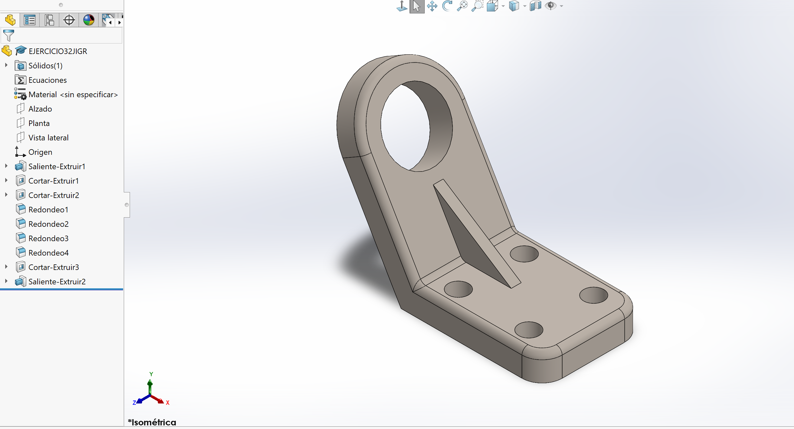

---

<h2 id="dibujo-33">Dibujo 33 Ismael Guerrero</h2>

Descarga del archivo de la pieza CAD nativa.

    <a href="../recursos/archivos/EJERCICIO33JIGR.SLDPRT" target="_blank">[Descargar (SLDPRT)]</a>

    

---

<h2 id="dibujo-34">Dibujo 34 Ismael Guerrero</h2>

Descarga del archivo de la pieza CAD nativa.

    <a href="../recursos/archivos/EJERCICIO34JIGR.SLDPRT" target="_blank">[Descargar (SLDPRT)]</a>

    

---

<h2 id="dibujo-35">Dibujo 35 Ismael Guerrero</h2>

Descarga del archivo de la pieza CAD nativa.

    <a href="../recursos/archivos/EJERCICIO35JIGR.SLDPRT" target="_blank">[Descargar (SLDPRT)]</a>

    

---

<h2 id="dibujo-36">Dibujo 36 Ismael Guerrero</h2>

Descarga del archivo de la pieza CAD nativa.

    <a href="../recursos/archivos/EJERCICIO36JIGR.SLDPRT" target="_blank">[Descargar (SLDPRT)]</a>

    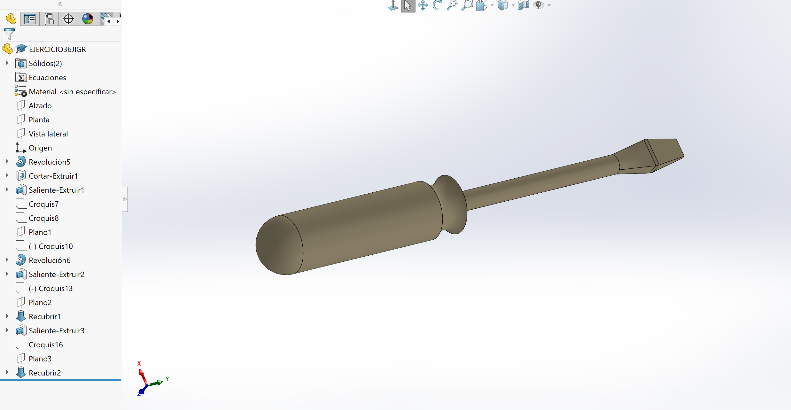

---

<h2 id="dibujo-37">Dibujo 37 Ismael Guerrero</h2>

Descarga del archivo de la pieza CAD nativa.

    <a href="../recursos/archivos/EJERCICIO37JIGR.SLDPRT" target="_blank">[Descargar (SLDPRT)]</a>

    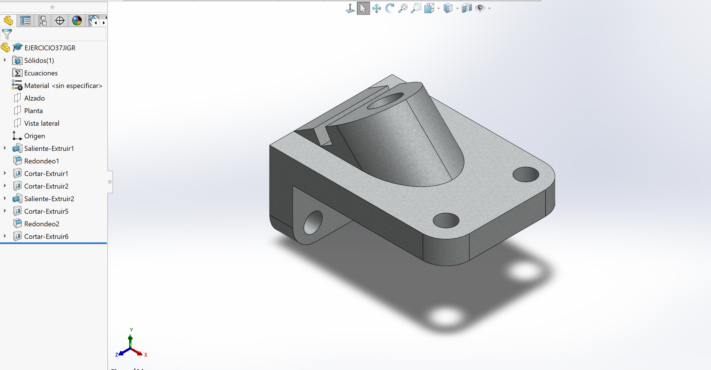

---
<h2 id="dibujo-40">Dibujo 40 Ismael Guerrero</h2>

Descarga del archivo de la pieza CAD nativa.

    <a href="../recursos/archivos/EJERCICIO40JIGR.SLDPRT" target="_blank">[Descargar (SLDPRT)]</a>

    

