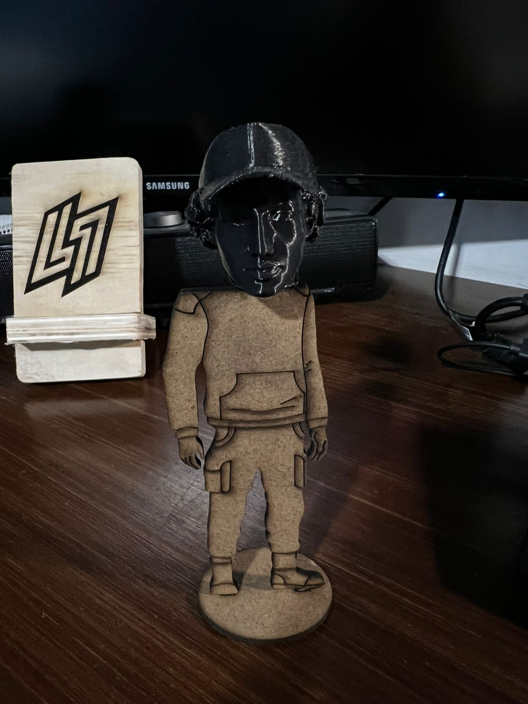
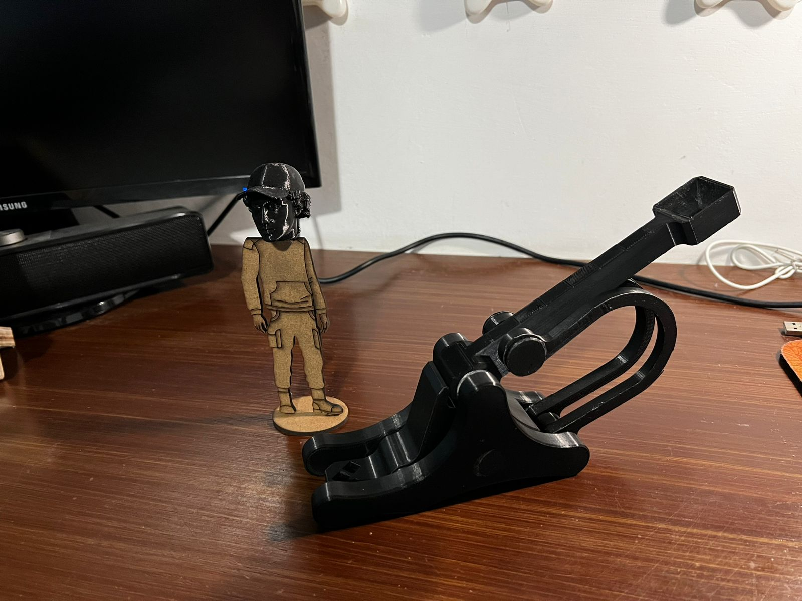

<h1 id="proyecto-final">Proyecto Final: Integración de Sistemas y Simulación de Producción</h1>

* <strong>Tema Central:</strong> Aplicación Integral de la Fabricación Digital (FD).

<h2 id="batalla-medieval">Batalla Medieval: Síntesis de Conocimientos</h2>

    El proyecto final fue una <strong>simulación de un ciclo de producción</strong> que exigió la integración de múltiples tecnologías de Fabricación Digital: <strong>Modelado 3D</strong>, <strong>Escaneo 3D</strong>, <strong>Impresión 3D (FDM)</strong> y <strong>Corte Láser (CNC)</strong>. El objetivo fue diseñar y fabricar un muñeco y un arma medieval (catapulta) utilizando al menos dos métodos de fabricación digital.
    Esto demostró la capacidad de seleccionar la <strong>herramienta correcta para la tarea correcta</strong> (Corte Láser para partes planas del cuerpo; Impresión 3D para la forma orgánica y personalizada del rostro), optimizando el proceso de manufactura.

<h3 id="archivos-resultados-proyecto">Archivos y Resultados</h3>

<a href="../recursos/archivos/cara3d.stl" target="_blank">[cara3d (stl)]</a>

<a href="../recursos/archivos/muñeco.dxf" target="_blank">[muñeco (DXF)]</a>

<a href="../recursos/archivos/catapulta.zip" target="_blank">[CATAPULTA (ZIP)]</a>

